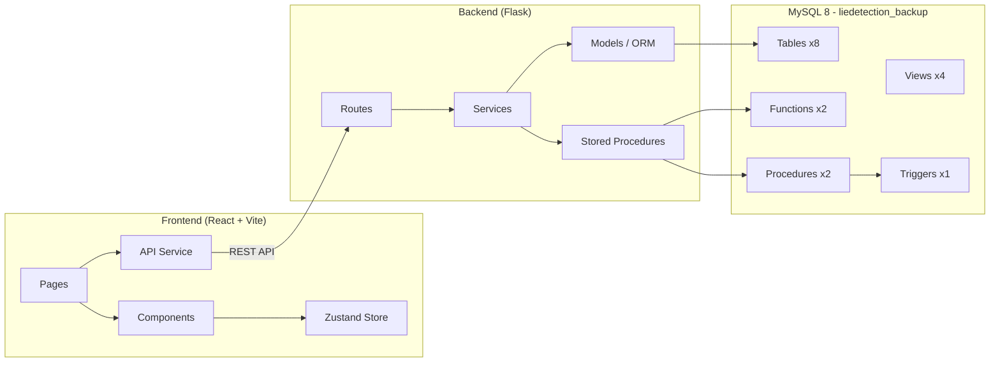

# ReviewShield AI — Walkthrough

A full-stack explainable AI-powered review authenticity and trust scoring platform, built with Flask + MySQL backend and React + Vite neobrutalist frontend.

## Architecture



## What Was Built

### Backend (Flask API)
| Component | Files | Description |
|-----------|-------|-------------|
| **Config** | [config.py](file:///c:/Users/mdiza/coding/WRC/dbms/backend/config.py) | MySQL connection, JWT settings |
| **DB Layer** | [connection.py](file:///c:/Users/mdiza/coding/WRC/dbms/backend/db/connection.py) | SQLAlchemy ORM + raw connector for SPs |
| **Models** | 8 files in [models/](file:///c:/Users/mdiza/coding/WRC/dbms/backend/models/) | All 8 database tables mapped |
| **Routes** | [auth.py](file:///c:/Users/mdiza/coding/WRC/dbms/backend/routes/auth.py), [products.py](file:///c:/Users/mdiza/coding/WRC/dbms/backend/routes/products.py), [reviews.py](file:///c:/Users/mdiza/coding/WRC/dbms/backend/routes/reviews.py), [analytics.py](file:///c:/Users/mdiza/coding/WRC/dbms/backend/routes/analytics.py), [admin.py](file:///c:/Users/mdiza/coding/WRC/dbms/backend/routes/admin.py) | 15+ REST endpoints |
| **Services** | [auth](file:///c:/Users/mdiza/coding/WRC/dbms/backend/services/auth_service.py), [review](file:///c:/Users/mdiza/coding/WRC/dbms/backend/services/review_service.py), [analytics](file:///c:/Users/mdiza/coding/WRC/dbms/backend/services/analytics_service.py), [moderation](file:///c:/Users/mdiza/coding/WRC/dbms/backend/services/moderation_service.py) | Business logic layer |
| **Utils** | [decorators.py](file:///c:/Users/mdiza/coding/WRC/dbms/backend/utils/decorators.py), [responses.py](file:///c:/Users/mdiza/coding/WRC/dbms/backend/utils/responses.py) | JWT auth, admin guards, response helpers |
| **Seed** | [seed.py](file:///c:/Users/mdiza/coding/WRC/dbms/backend/seed.py) | 20 users, 15 products, 55 reviews, 38 votes, 11 reports |

### Frontend (React + Vite + Tailwind)
| Page | Route | Description |
|------|-------|-------------|
| Landing | `/` | Hero section, live metrics, feature cards, CTA |
| Login | `/login` | Neobrutalist form, JWT auth |
| Register | `/register` | Form with validation |
| Dashboard | `/dashboard` | Stats cards, pie chart, bar chart, suspicious feed |
| Products | `/products` | Search, category filter, product grid |
| Product Detail | `/products/:id` | Trust meter, rating distribution, reviews |
| Review Submit | `/review/submit` | Star rating, device select, live trust result |
| Review Detail | `/review/:id` | Trust meter, AI explainability, vote/report |
| Profile | `/profile` | Credibility meter, stats, score breakdown |
| Analytics | `/analytics` | Classification pie, trust distribution, sentiment trend, leaderboard |
| Admin Moderation | `/admin/moderation` | Expandable queue, approve/reject, priority indicators |

## Database Integration

The app fully leverages the existing database schema:
- **Stored Procedures**: `submit_review()` and `report_review()` are called via raw MySQL connector
- **Functions**: `calculate_trust_score()` and `classify_review()` are called within the procedures
- **Trigger**: `after_flag_insert` automatically populates the moderation queue for suspicious/deceptive reviews
- **Views**: `review_overview`, `suspicious_reviews`, `top_reviewers`, `product_trust` are queried for analytics
- **Role column**: Added `role ENUM('user','admin')` to the `user` table for RBAC

## UI Showcase

### Login Page


### Dashboard


### Analytics


### Admin Moderation


### Full Flow Recording


## Verification Results

| Test | Status | Notes |
|------|--------|-------|
| Backend starts on port 5000 | ✅ | Flask dev server running |
| Frontend starts on port 5173 | ✅ | Vite dev server running |
| Database seeded successfully | ✅ | 20 users, 15 products, 55 reviews, 38 votes, 11 reports |
| Login/Register flow | ✅ | JWT auth working, bcrypt password hashing |
| Dashboard stats & charts | ✅ | 55 total reviews, 38 suspicious, 65% avg trust |
| Product explorer with search | ✅ | All 15 products with trust scores |
| Product detail with reviews | ✅ | Rating distribution, review cards, sort options |
| Review submission via SP | ✅ | Calls `submit_review`, returns trust score + classification |
| Review detail + explainability | ✅ | Trust meter, AI reasons, confidence, vote/report |
| Analytics charts | ✅ | Pie, bar, line charts with real data from views |
| Admin moderation queue | ✅ | 38 pending items, approve/reject actions |
| Dark mode toggle | ✅ | Theme persists via localStorage |
| Role-based access (admin section) | ✅ | Admin sidebar visible only for admin users |

## How to Run

```bash
# Backend (port 5000)
cd backend
pip install -r requirements.txt
python seed.py    # First time only
python app.py

# Frontend (port 5173)
cd frontend
npm install
npm run dev
```

**Credentials**: `admin@reviewshield.ai / admin123` (admin) or `priya@gmail.com / pass123` (user)
